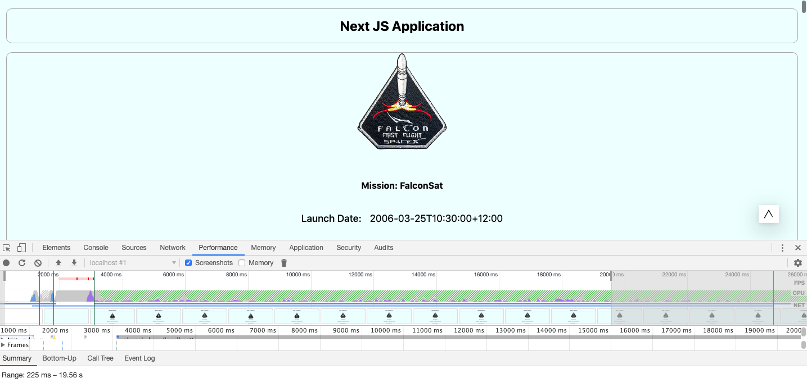

# Performace Comparison

This repository shows the performance comparision in **ReactJS (Client Side Rendering)** and **NextJS (Server Side Rendering)** application.

# Steps:

## Run React Application

Run the following commands:

**Step-1** Navigate to ReactJS app directory

`cd reactjs`

**Step-2** Install the dependencies

`yarn i`

**Step-3** Run the application

`yarn start`

Application should start running at [port 3000](http://localhost:3000/)

## Run Next Application

Run the following commands:

**Step-1** Navigate to NextJS app directory

`cd nextjs`

**Step-2** Install the dependencies

`yarn i`

**Step-3** Run the application

`yarn dev`

Application should start running at [port 4000](http://localhost:4000/)

### API

We are using [SpaceX API](https://api.spacexdata.com/v3/launches) to pull the data and display it.

## Performance

### ReactJ S

./performance/react.png)

### Next JS

